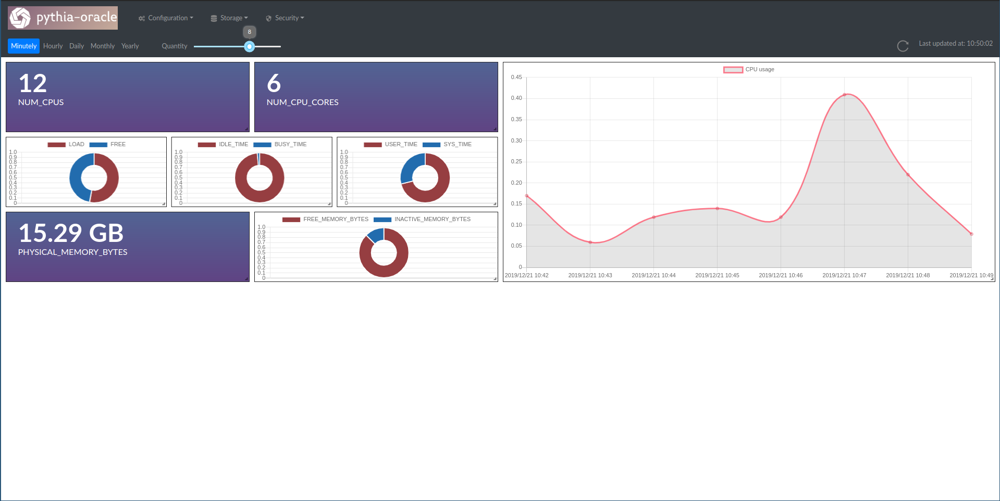

# pythia-oracle
Oracle Database Status and Performance Monitor

## Features

- CPU, Memory, Tablespaces, Datafiles, Users and Sessions monitoring

- Dashboards with draggable and resizable graphs and indicators

- Multiple data quantity and granularity

- In-database statistical analysis

## Example

  

